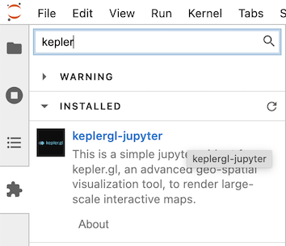
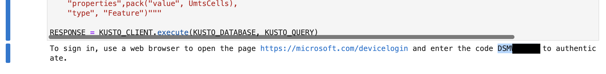

# Generating and Visualizing H3 Cell Data with Azure Data Explorer and Python

Azure Data Explorer and Kusto is a fanstasic engine for ingesting and processing geospatial data, and the Kusto Language has many built-in functions for working with H3. 

This repostory has some examples of visualizing H3 data, and is designed to use the OpenCell dataset with Azure Data Explorer. To excute these examples, you'll want to follow this high-level flow:

1. Create an Azure Data Explorer cluster. You can do this in your existing Azure subscription, or [create your own personal cluster for free](https://docs.microsoft.com/en-us/azure/data-explorer/start-for-free).
2. Create your target database
3. Run the KQL commands provided to create your raw (staging) table, ingestion mapping, target table, and update policy and function.
4. Download the OpenCell Dataset, or a subset of the data by country code (MCC): https://opencellid.org/downloads.php (Note: registration is required to download the data)
5. Use OneClick Ingestion to load your dataset
6. Install dependancies
7. Run notebook in Jupyter/Jupyter Hub/Jupyter Labs

## Dependancies

To run the examples included in this demo, please make sure you install the following:

1. Python 3.8+: Your install path may vary between Windows, MacOS, and Linux.
2. Python libraries. Use ```pip install``` to install the following libraries
   1. azure-kusto-data
   2. plotly
   3. geojson
   4. pandas
   5. keplergl

Note: A requirements file is also provided; you can install all the requirements with ```pip install -r requirements.txt``` to handle this for you.

3. Jupyter Notebooks: To fully experience these demos, it is highly reccomended to either install Jupyter locally or use Jupyter Hub. Check out the Jupyter docs on how to install and run locally: https://jupyter.org/install 

4. Kepler.gl Jupyter Extensions: To fully render the Kepler.gl interface, please refer to this installation document on the Kepler.gl site: https://docs.kepler.gl/docs/keplergl-jupyter#install For local use, if you are using Jupyter Labs, you can install the extension directly from the web UI:



## Running the Demo

Once you have all the requirements satisfied, open the notebook. Note that you will need to provide the cluster URL of your Azure Data Explorer cluster in cell #2. If you loaded a different country's data (the demo uses The Netherlands, MCC = 204), modify your where clause in the Kusto query in cell #4.

When executing your query, the Notebook will prompt you for your login credentials and give you a "device code" that you will need. Depending on your OS and browser, you may not see this right away. It will appear at the bottom of the cell:


